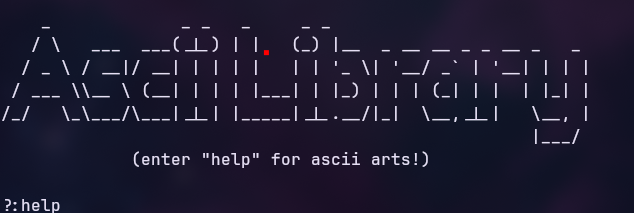

# ASCII Art Menu

A small command-line "art gallery" written in Python. Run it, type a keyword, and it prints the matching ASCII art straight to your terminal. No dependencies, no install — just Python and a terminal that can render Unicode.

Built as a fun little side project — took about 1-3 hours from start to finish.

## Showcase



## Features

- 60+ pieces of ASCII art covering animals, tech/OS logos, space, vehicles, and more
- Simple `help` command that lists every available keyword
- Clean exit on `Ctrl+C` (no ugly traceback, just a friendly goodbye message)
- Zero external dependencies — pure Python standard library (`signal`, `sys`)
- Loops back to the menu automatically after every art print, so you can keep browsing

## Requirements

- Python 3.x
- A terminal/font that supports Unicode block and box-drawing characters (most modern terminals do)

## Usage

Clone or download the repo, then run:

```bash
python3 ascii-library.py
```

You'll see a banner and a `?:` prompt. Type any of the supported keywords and press Enter to print that art. Type `help` at any time to see the full list. Press `Ctrl+C` whenever you want to quit.

## Available keywords

<details>
<summary>Click to expand the full list</summary>

| Category | Keywords |
|---|---|
| Animals | `dragon`, `cow`, `pig`, `dog`, `cat`, `crocodile`, `moose`, `wolf`, `bird`, `dolphin`, `fish`, `mouse` |
| Tech / OS / Software | `computer`, `linux`, `windows`, `gentoo`, `archlinux`, `python`, `c++`, `gnu`, `gnome`, `gimp`, `bsd` |
| Devices | `laptop`, `phone`, `gameboy`, `camera`, `telescope` |
| Space | `moon`, `saturn`, `earth`, `nasa`, `alien` |
| Vehicles | `plane`, `car`, `boat`, `helicopter`, `submarine`, `balloon` |
| Misc / fun | `eye`, `human`, `creators name`, `bad apple`, `discord`, `youtube`, `stars`, `money`, `guitar`, `teddy`, `pikachu`, `pacman`, `beach`, `tent`, `tornado`, `sunset` |

Type `help` in the program itself for the live, authoritative list.

</details>

## How it works

The program is a single `main()` loop that:

1. Prints the banner menu
2. Reads a line of input
3. Compares it against a long chain of `elif` branches, each printing a raw-string ASCII art block
4. Loops back to step 1

A `SIGINT` handler (`Ctrl+C`) is registered up front so exiting the program always prints a friendly "Program closed by user. Goodbye!" message instead of a Python traceback.

## Project structure

```
.
├── ascii-library.py   # the whole program lives here
├── showcase.png       # screenshot used in this README
└── README.md          # this file
```

Everything is intentionally kept in one file — there's no logic complex enough yet to justify splitting it up.

## Contributing

This is a personal project and I'd like to keep the art selection curated myself, so please **don't open pull requests adding new ASCII art**. If you have an art suggestion, open an issue describing it instead and I'll consider adding it.

Pull requests are welcome for other things, though — bug fixes (like the one above), code cleanup, or splitting the file into modules.

## Credits

The ASCII art used in this project was sourced from:

- [https://www.asciiart.eu/](https://www.asciiart.eu/)
- [https://emojicombos.com/](https://emojicombos.com/)

If any of this art is yours and you'd like credit added, changed, or the piece removed entirely, please **open an issue** and we'll sort it out — no need to escalate, just start a conversation.

## License

No license specified yet. Assume all rights reserved until one is added, aside from the third-party ASCII art credited above, which belongs to its original creators.
